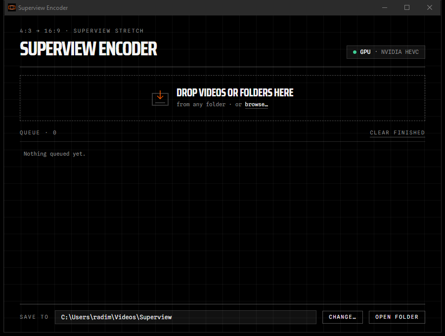

# Superview Encoder

Stretch 4:3 action-cam footage (GoPro, DJI) to 16:9, GoPro "SuperView" style: the
middle of the frame stays natural and the edges take the stretch. Drag videos in from
any folder, and they're converted on your graphics card at the original quality.



## Download

| | Download |
|---|---|
| **Windows** 10/11 | [Superview-Encoder.zip](https://github.com/FuradiCon/superview-encoder/releases/latest/download/Superview-Encoder.zip) |
| **Mac, Apple Silicon** (M1 and later) | [Superview-Encoder-Mac-AppleSilicon.zip](https://github.com/FuradiCon/superview-encoder/releases/latest/download/Superview-Encoder-Mac-AppleSilicon.zip) |
| **Mac, Intel** | [Superview-Encoder-Mac-Intel.zip](https://github.com/FuradiCon/superview-encoder/releases/latest/download/Superview-Encoder-Mac-Intel.zip) |

Not sure which Mac you have? Go to Apple menu → About This Mac. The "Chip" line says Apple M-something (Apple Silicon) or Intel.

### Windows first launch

1. Unzip the whole folder somewhere and keep the files together.
2. Double-click `Superview Encoder.exe`. The app isn't code-signed, so Windows shows a blue
   "Windows protected your PC" screen. Click **More info**, then **Run anyway**. You only do this once.
3. Drag videos or folders onto the window. Converted files land in `Videos\Superview`,
   or in whichever folder you pick with **Change…**.

> [!WARNING]
> **Windows 11 with Smart App Control:** if Smart App Control is **On** (or in **Evaluation** mode),
> Windows blocks unsigned apps like this one outright, with no "Run anyway" button. The only way to run
> it is to turn Smart App Control off: **Windows Security → App & browser control → Smart App Control
> settings → Off**.
>
> Before you do, know that on many Windows 11 versions **Smart App Control can't be switched back on
> without resetting or reinstalling Windows**. It's your call. Other protection like Microsoft Defender
> antivirus keeps working either way. If yours is already off, or you're on Windows 10, skip this and
> just use the "Run anyway" step above.

### Mac first launch

1. Unzip, then **drag `Superview Encoder` into Applications**. Don't run it from Downloads.
2. Open it. macOS says it can't verify the app, because it isn't signed with a paid Apple developer
   account. Click **Done**.
3. Go to **System Settings → Privacy & Security**, scroll down, click **Open Anyway**, and enter your
   password. After that it opens normally.
4. Still blocked? Paste this into Terminal: `xattr -cr "/Applications/Superview Encoder.app"`

Converted files land in `Movies/Superview`. The Mac builds are built and self-tested automatically on
GitHub's Macs but haven't been clicked through by a person yet. If something's off, please
[open an issue](https://github.com/FuradiCon/superview-encoder/issues).

## What it does

- Uses the SuperView stretch formula from [Niek/superview](https://github.com/Niek/superview),
  byte for byte, and fixes its crash on DJI files, which carry a hidden preview video stream.
- Encodes to HEVC on the GPU: NVIDIA, Intel, or AMD on Windows, and Apple VideoToolbox on Mac. It falls back to the CPU (slow) when no GPU encoder is available.
- Keeps 10-bit color and matches the source bitrate. There are no quality settings to fiddle with.
- Queues files one at a time. You can cancel, and failed files show ffmpeg's actual error.

## Building from source

Requires Python 3.14 on Windows.

```powershell
py -3 -m venv .venv
.venv\Scripts\python -m pip install -r requirements.txt
.venv\Scripts\python tools\fetch_fonts.py          # fonts are already committed; only needed to refresh them
# put ffmpeg.exe + ffprobe.exe (Gyan "essentials" build) into ffmpeg\
.venv\Scripts\python -m pytest                     # 26 tests; -m "not slow" skips real encodes
.venv\Scripts\python app.py                        # run from source
powershell -ExecutionPolicy Bypass -File build.ps1 # build dist\ and the zip
```

## License

The app code is MIT licensed (see `LICENSE`). The release zip bundles FFmpeg (GPL v3, from
[gyan.dev](https://www.gyan.dev/ffmpeg/builds/)) and three fonts under the SIL Open Font License.
Their licenses and credits are in `dist-extras/LICENSES/`.
